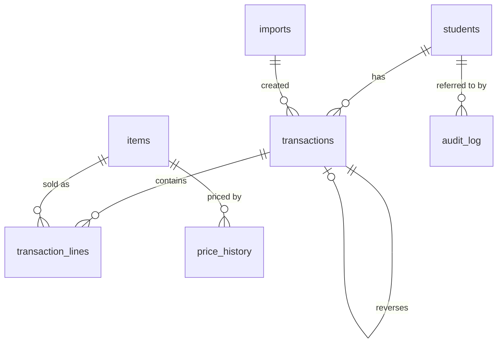

# 09 — Data Model

All data lives in one SQLite file: `C:\ProgramData\CashCafe\cashcafe.db`.

SQLite was chosen because it is a single file (easy to back up, copy and
restore), needs no server or administrator, is transactional and crash-safe, and
will still be readable in decades — it is one of the most widely deployed and
best-documented file formats in existence.

Connection settings used by the program:

```
PRAGMA journal_mode = WAL;      -- crash safety + concurrent readers
PRAGMA synchronous  = FULL;     -- a committed sale survives a power cut
PRAGMA foreign_keys = ON;
PRAGMA busy_timeout = 5000;
```

## The shape of it



---

## `students`

```sql
CREATE TABLE students (
    id              INTEGER PRIMARY KEY,
    first_name      TEXT    NOT NULL,
    last_name       TEXT    NOT NULL DEFAULT '',
    display_name    TEXT    NOT NULL,           -- what the till shows
    search_name     TEXT    NOT NULL,           -- normalised: lower, accents folded
    class_name      TEXT,                       -- '9B', optional
    balance_ore     INTEGER NOT NULL DEFAULT 0, -- CACHE of SUM(transactions.amount_ore)
    credit_limit_ore INTEGER,                   -- NULL = use settings.minimum_balance
    is_active       INTEGER NOT NULL DEFAULT 1,
    note            TEXT,
    merged_into_id  INTEGER REFERENCES students(id),
    created_utc     TEXT    NOT NULL,
    created_by      TEXT    NOT NULL,
    last_activity_utc TEXT
);
CREATE INDEX ix_students_search ON students(search_name);
CREATE INDEX ix_students_active ON students(is_active, display_name);
```

- `balance_ore` is a cache. The ledger is the truth
  ([Balance Rules](08-Balance-Rules.md#how-a-balance-is-defined)).
- `search_name` is `display_name` lower-cased with å/ä→a, ö→o, é→e, punctuation
  and repeated spaces removed. It powers the till's live search.
- `merged_into_id` keeps a tombstone when two duplicate students are merged, so
  old references still resolve.
- **Nothing else about a person is stored.** No personal identity number, no
  address, no email, no photo, no allergy or dietary data. See
  [Security & Privacy](12-Security-and-Privacy.md).

## `items`

```sql
CREATE TABLE items (
    id            INTEGER PRIMARY KEY,
    name          TEXT    NOT NULL,
    search_name   TEXT    NOT NULL,
    category      TEXT,
    price_ore     INTEGER NOT NULL CHECK (price_ore >= 0),
    is_available  INTEGER NOT NULL DEFAULT 1, -- shown at the till
    is_archived   INTEGER NOT NULL DEFAULT 0, -- removed but has sales history
    sort_order    INTEGER NOT NULL DEFAULT 0,
    created_utc   TEXT    NOT NULL
);
```

## `price_history`

```sql
CREATE TABLE price_history (
    id           INTEGER PRIMARY KEY,
    item_id      INTEGER NOT NULL REFERENCES items(id),
    price_ore    INTEGER NOT NULL,
    valid_from_utc TEXT  NOT NULL,
    valid_to_utc   TEXT,                  -- NULL = current price
    changed_by   TEXT    NOT NULL,
    reason       TEXT
);
```

Written automatically whenever `items.price_ore` changes. Reports never need it
(each sale stores its own price) but it answers "when did the toast go up?".

## `transactions` — the ledger

The heart of the system. **Append-only.**

```sql
CREATE TABLE transactions (
    id              INTEGER PRIMARY KEY,
    student_id      INTEGER NOT NULL REFERENCES students(id),
    type            TEXT    NOT NULL
                    CHECK (type IN ('PURCHASE','DEPOSIT','ADJUSTMENT','REVERSAL','IMPORT')),
    amount_ore      INTEGER NOT NULL,        -- negative = money leaves the student
    balance_after_ore INTEGER NOT NULL,      -- balance immediately after this row
    occurred_utc    TEXT    NOT NULL,        -- when it happened
    recorded_utc    TEXT    NOT NULL,        -- when it was written (differs if back-dated)
    operator        TEXT    NOT NULL,        -- 'Café (till 1)' | 'Admin'
    session_id      TEXT    NOT NULL,        -- one id per program run
    method          TEXT,                    -- deposits: Swish | Cash | Bank | Other
    reference       TEXT,                    -- Swish reference etc.
    reason          TEXT,                    -- required for ADJUSTMENT and REVERSAL
    reverses_id     INTEGER REFERENCES transactions(id),
    import_id       INTEGER REFERENCES imports(id),
    note            TEXT,
    CHECK (type <> 'ADJUSTMENT' OR reason IS NOT NULL),
    CHECK (type <> 'REVERSAL'   OR (reason IS NOT NULL AND reverses_id IS NOT NULL)),
    CHECK (type <> 'DEPOSIT'    OR amount_ore > 0),
    CHECK (type <> 'PURCHASE'   OR amount_ore < 0)
);
CREATE INDEX ix_tx_student ON transactions(student_id, occurred_utc);
CREATE INDEX ix_tx_when    ON transactions(occurred_utc);
CREATE INDEX ix_tx_type    ON transactions(type, occurred_utc);
CREATE UNIQUE INDEX ux_tx_reverses ON transactions(reverses_id) WHERE reverses_id IS NOT NULL;
```

Append-only is enforced in the database itself, not just in the application:

```sql
CREATE TRIGGER trg_tx_no_update BEFORE UPDATE ON transactions
BEGIN SELECT RAISE(ABORT, 'transactions are append-only'); END;

CREATE TRIGGER trg_tx_no_delete BEFORE DELETE ON transactions
BEGIN SELECT RAISE(ABORT, 'transactions cannot be deleted'); END;
```

The unique index on `reverses_id` is what makes it impossible to reverse the
same transaction twice, even under a race.

## `transaction_lines`

One row per item row on the till, for `PURCHASE` transactions.

```sql
CREATE TABLE transaction_lines (
    id             INTEGER PRIMARY KEY,
    transaction_id INTEGER NOT NULL REFERENCES transactions(id),
    line_no        INTEGER NOT NULL CHECK (line_no BETWEEN 1 AND 20),
    item_id        INTEGER REFERENCES items(id),   -- NULL for a custom amount
    item_name      TEXT    NOT NULL,               -- name AS SOLD
    unit_price_ore INTEGER NOT NULL,               -- price AS SOLD
    quantity       INTEGER NOT NULL CHECK (quantity BETWEEN 1 AND 99),
    line_total_ore INTEGER NOT NULL,
    is_custom      INTEGER NOT NULL DEFAULT 0
);
CREATE INDEX ix_lines_tx   ON transaction_lines(transaction_id);
CREATE INDEX ix_lines_item ON transaction_lines(item_id);
```

Storing `item_name` and `unit_price_ore` here — rather than joining to `items` —
is what makes history immune to later price changes and renames.

Invariant, checked on write and by **Verify database**:

```
transactions.amount_ore = -SUM(transaction_lines.line_total_ore)   for a PURCHASE
```

## `imports`

```sql
CREATE TABLE imports (
    id             INTEGER PRIMARY KEY,
    file_name      TEXT NOT NULL,
    archived_path  TEXT NOT NULL,   -- the untouched copy of the source file
    file_sha256    TEXT NOT NULL,
    sheet_name     TEXT,
    mapping_json   TEXT NOT NULL,   -- the column mapping that was used
    rows_read      INTEGER NOT NULL,
    students_created INTEGER NOT NULL,
    transactions_created INTEGER NOT NULL,
    total_ore      INTEGER NOT NULL,
    imported_utc   TEXT NOT NULL,
    imported_by    TEXT NOT NULL,
    undone_utc     TEXT
);
```

The SHA-256 means you can prove which file a number came from, and detect if
someone re-imports a modified copy of the same sheet.

## `audit_log`

```sql
CREATE TABLE audit_log (
    id           INTEGER PRIMARY KEY,
    occurred_utc TEXT NOT NULL,
    actor        TEXT NOT NULL,           -- 'Admin' | 'Café (till 1)' | 'System'
    session_id   TEXT NOT NULL,
    action       TEXT NOT NULL,           -- PURCHASE, PRICE_CHANGE, LOGIN_FAILED, BACKUP…
    entity_type  TEXT,                    -- student | item | transaction | setting
    entity_id    INTEGER,
    old_value    TEXT,                    -- JSON
    new_value    TEXT,                    -- JSON
    detail       TEXT
);
CREATE INDEX ix_audit_when ON audit_log(occurred_utc);
CREATE TRIGGER trg_audit_no_update BEFORE UPDATE ON audit_log
BEGIN SELECT RAISE(ABORT, 'audit log is append-only'); END;
CREATE TRIGGER trg_audit_no_delete BEFORE DELETE ON audit_log
BEGIN SELECT RAISE(ABORT, 'audit log is append-only'); END;
```

## `settings`

```sql
CREATE TABLE settings (
    key        TEXT PRIMARY KEY,
    value      TEXT NOT NULL,
    updated_utc TEXT NOT NULL,
    updated_by TEXT NOT NULL
);
```

Keys include `cafe_name`, `minimum_balance_ore` (default `-1000`),
`undo_window_minutes` (`15`), `max_lines_per_purchase` (`10`),
`large_purchase_warning_ore` (`50000`), `low_balance_warning_ore` (`2000`),
`language`, `kiosk_mode`, `backup_*`.

The admin PIN hash and cloud tokens are **not** here — they are in Windows
Credential Manager, protected by DPAPI
([Security & Privacy](12-Security-and-Privacy.md#secrets)).

## `schema_version`

```sql
CREATE TABLE schema_version (
    version     INTEGER NOT NULL,
    applied_utc TEXT NOT NULL,
    app_version TEXT NOT NULL
);
```

---

## Worked example

Carl (id 41) has 50,00 kr and buys 1 toast (10 kr) and 2 juice (15 kr):

```sql
BEGIN IMMEDIATE;

-- re-read prices and re-check the floor here, inside the transaction

INSERT INTO transactions
  (student_id, type, amount_ore, balance_after_ore, occurred_utc, recorded_utc,
   operator, session_id)
VALUES (41, 'PURCHASE', -4000, 1000, '2026-09-12T09:14:07Z', '2026-09-12T09:14:07Z',
        'Café (till 1)', 'a3f1…');
-- new id = 1043

INSERT INTO transaction_lines
  (transaction_id, line_no, item_id, item_name, unit_price_ore, quantity, line_total_ore)
VALUES (1043, 1, 3, 'Toast', 1000, 1, 1000),
       (1043, 2, 7, 'Juice', 1500, 2, 3000);

UPDATE students SET balance_ore = 1000, last_activity_utc = '2026-09-12T09:14:07Z'
WHERE id = 41 AND balance_ore = 5000;   -- optimistic check: 0 rows = abort

INSERT INTO audit_log (...) VALUES (...);

COMMIT;
```

The `AND balance_ore = 5000` is the concurrency guard: if anything else changed
Carl's balance between reading and writing, the update affects zero rows and the
whole transaction is rolled back and retried.

Undoing it two minutes later adds, and never removes:

```sql
INSERT INTO transactions
  (student_id, type, amount_ore, balance_after_ore, occurred_utc, recorded_utc,
   operator, session_id, reason, reverses_id)
VALUES (41, 'REVERSAL', 4000, 5000, '2026-09-12T09:16:20Z', '2026-09-12T09:16:20Z',
        'Café (till 1)', 'a3f1…', 'Undo at counter', 1043);
```

## Integrity checks

**Admin → Backup & Cloud → Verify database** (also run on every start) checks:

1. `PRAGMA integrity_check` — SQLite's own structural check.
2. For every student: `balance_ore = SUM(transactions.amount_ore)`.
3. For every purchase: `amount_ore = -SUM(line_total_ore)`.
4. For every line: `line_total_ore = unit_price_ore * quantity`.
5. Every `reverses_id` points at an existing, un-reversed transaction.
6. `balance_after_ore` forms a correct running total per student, in time order.
7. No student is below their effective floor without an `ADJUSTMENT` explaining it.

Any failure names the exact rows involved. The program will not start on a failed
check 1 or 2; the others produce a warning and a report.

## Migrations

Schema changes ship as numbered SQL scripts (`001_initial.sql`,
`002_add_categories.sql`, …), applied in order inside one transaction, with an
automatic backup taken first. Migrations are forward-only; to go back you restore
the pre-update backup. The application refuses to open a database whose
`schema_version` is **newer** than itself, rather than risk writing to it.

## Size

A busy café at 200 sales a day uses roughly **2 MB per school year**. There is no
practical need to archive or prune anything; keep the whole history.
